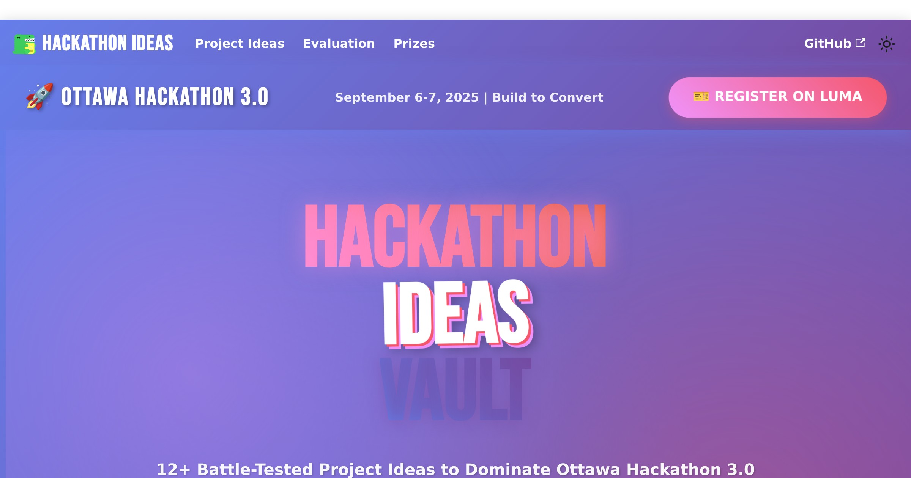

# 🚀 Ottawa Hackathon 3.0 Ideas Vault



## 🔥 What's This All About?

**ATTENTION HACKERS!** Are you ready to DOMINATE Ottawa Hackathon 3.0 (September 6-7, 2025)?

This isn't just another boring project list. This is your **SECRET WEAPON** - a curated vault of 12+ battle-tested hackathon ideas specifically designed to:

- 💰 **WIN BIG** - Ideas optimized for hackathon judging criteria
- ⚡ **BUILD FAST** - 24-hour feasible projects with clear implementation paths  
- 🎯 **CONVERT QUICK** - B2B/B2C ideas ready for immediate sales
- 🚀 **GO VIRAL** - Built-in growth mechanisms for explosive traction

## 🏆 Why These Ideas Will Make You WIN

Every project in this vault has been carefully selected based on:

### The Winning Formula™️
- **Most Revenue Generated** - Ideas that can make REAL sales during the hackathon
- **Fastest to Sales** - B2C: 5 sales | B2B: 1 sale targets
- **Most Waitlist Signups** - Viral potential built right in
- **Unique GTM Strategy** - Creative launches that judges LOVE

## 🎯 Quick Navigation

### 🔥 Top 3 Killer Ideas
1. **[MeetingMoney](https://hackathon-ideas.ciprianrarau.com/docs/project-ideas/meeting-money)** - Calculate real-time meeting costs. Guaranteed viral hit!
2. **[AI Cold Email Personalizer](https://hackathon-ideas.ciprianrarau.com/docs/project-ideas/ai-cold-email)** - 10x email response rates. B2B goldmine!
3. **[EcoScore Calculator](https://hackathon-ideas.ciprianrarau.com/docs/project-ideas/ecoscore-calculator)** - Gamified carbon tracking. Environmental prize winner!

### ⚡ By Build Time
- **[Quick Picks](https://hackathon-ideas.ciprianrarau.com/docs/quick-picks)** - Can build in < 12 hours
- **[Full Projects](https://hackathon-ideas.ciprianrarau.com/docs/intro)** - Complete 24-hour builds

### 💼 By Market
- **B2B Champions** - Enterprise-ready, high-ticket ideas
- **B2C Viral Hits** - Consumer apps with explosive growth
- **B2B/B2C Hybrids** - Double your market, double your chances

## 🚀 Getting Started

### Option 1: Browse Online (Recommended)
Visit **[hackathon-ideas.ciprianrarau.com](https://hackathon-ideas.ciprianrarau.com)** for the full experience with:
- Interactive project filters
- Detailed implementation guides
- Tech stack recommendations
- Go-to-market strategies
- Prize category mappings

### Option 2: Run Locally
```bash
# Clone the vault
git clone https://github.com/crarau/hackathon-ideas.git
cd hackathon-ideas

# Install dependencies
npm install

# Start the development server
npm run start
```

Your vault will be available at `http://localhost:3000`

## 📊 The Numbers Don't Lie

- **12+** Curated Project Ideas
- **5** Prize Categories Covered
- **24** Hours to Victory
- **100%** Open Source

## 🎪 Event Details

### 📅 Ottawa Hackathon 3.0
- **Date:** September 6-7, 2025
- **Theme:** Build to Convert
- **Location:** Ottawa, Canada
- **[Register on Luma](https://luma.com/9k96tg5z?tk=EqpUKv)** 

## 🏅 Prize Categories We're Targeting

1. **💰 Most Revenue Generated** - Real money, real sales
2. **⚡ Fastest to Sales** - Speed matters in business
3. **👥 Most Waitlist Signups** - Build something people NEED
4. **🚀 Most Creative GTM** - Viral potential wins prizes
5. **🌱 Best Environmental Impact** - Save the world, win prizes

## 🛠️ Technical Details

### Installation
```bash
npm install
# or
yarn install
```

### Development
```bash
npm run start
# or
yarn start
```

### Build
```bash
npm run build
# or 
yarn build
```

This generates static content into the `build` directory.

### Tech Stack
- [Docusaurus](https://docusaurus.io/) - For blazing fast documentation
- Deployed on [Cloudflare Pages](https://pages.cloudflare.com/) - Global CDN for speed
- Maintained with ❤️ and lots of ☕

## 🤝 Contributing

Got a killer hackathon idea? We want it! 

1. Fork the repository
2. Create your feature branch (`git checkout -b feature/AmazingIdea`)
3. Commit your changes (`git commit -m 'Add AmazingIdea project'`)
4. Push to the branch (`git push origin feature/AmazingIdea`)
5. Open a Pull Request

## 📣 Spread the Word

Help your fellow hackers succeed! Share this vault:

- ⭐ Star this repo
- 🐦 Tweet about it with #OttawaHackathon
- 💬 Share in your hackathon Discord/Slack
- 📧 Send to your team

## 🎯 Remember: You're Not Here to Participate

**You're Here to WIN! 🏆**

Let's build something amazing together. See you at the hackathon!

---

<div align="center">

**[🚀 EXPLORE THE VAULT](https://hackathon-ideas.ciprianrarau.com)** | **[🎫 REGISTER FOR HACKATHON](https://luma.com/9k96tg5z?tk=EqpUKv)**

*Made with 💜 for Ottawa Hackathon 3.0*

</div>
